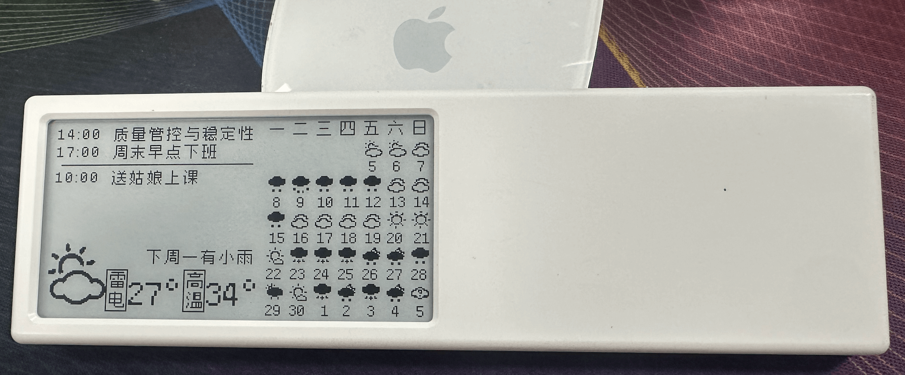
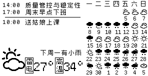

## Dot Calendar - 天气日历 for Quote/0
针对 Dot.开发的墨水屏，使用[和风天气](https://www.heweather.com/)的30日天气数据，制作成日历图表并推送到[Quote/0](https://dot.mindreset.tech/device/quote)。




> Quote/0 是一款可吸附在金属表面的智能墨水屏设备，旨在通过极简设计帮助用户减少信息过载并提升专注力。

注：也支持展示ToDo列表，这里附带了一个钉钉日历接口的实现方案用于调用钉钉的API接口获取日程信息，大家也可以自行使用其他方案实现这部分的数据补充。

## 功能介绍
- 使用日历的方式展示当地最近30天的天气数据
- 展示当天当地的天气、最低温度、最高温度
- 展示当天当地的预警信息
- 展示当地未来2小时内的雨雪雾天气情况，或未来两周内最近一日的雨雪雾。
- 展示ToDo列表（可参考demo接入钉钉日程，或另行实现相关ToDo文本的接入）

## 技术需求
需要一点开发能力，也需要大家有一台自己的服务器哈（或本地电脑）。

运行环境：PHP + Apache/Nginx
需要安装的PHP扩展：curl, gd, mbstring

## 获取授权

### 获取和风天气的秘钥
1. 访问[和风天气](https://console.qweather.com/)，注册一个开发者账号（每月免费5万次请求）
2. 登录账号，点击[项目管理](https://console.qweather.com/project)中，填写相关信息，申请并获取API密钥。
3. 在[开发者设置](https://console.qweather.com/setting)中，获取`API Host
`。
4. 记下申请的API密钥和`API Host`，并用于后续配置。

### 获取钉钉的caldav账户和密码
请参考[DingtalkCalDAVClient](https://github.com/wanyaxing/DingtalkCalDAVClient)的说明，获取钉钉的caldav账户和密码。

### 获取Quote/0的设备码和应用密钥
请参考[图像API](https://dot.mindreset.tech/docs/server/template/api/image_api)配置Quote/0的设备码和应用密钥。

## 安装部署
1. 下载本项目的代码到你的服务器上,并解压到指定目录，如`/htdocs/dot_calendar/`,使对应的访问地址为`http://你的域名/dot_calendar/`（或其他地址）
2. 在当前目录下，创建一个`config.php`文件，用于配置项目的环境变量。
```php
define('DOT_CALENDAR_TOKEN','xxxxxxx');
// 以上token请自行修改，防止被他人恶意调用
// 以下配置请根据自己的实际情况修改

// 此处配置钉钉的caldav账户和密码
define('DINGTALK_CALDAV_USER','u_wnkxxxx');
define('DINGTALK_CALDAV_PASS','pwdxxxxx');

// 此处配置和风天气的秘钥和API_HOST
define('QWEATHER_HOST','xxxxxxx.re.qweatherapi.com'); // 和风天气的host
define('QWEATHER_KEY','4248cdc45e564d148xxxxxxxxx'); // 和风天气的key


// 此处配置摘录墨水瓶的设备ID和秘钥
define('DOT_DEVICE_ID','9C9EXXX01,9C9EXXX02'); // 摘录电子墨水屏幕的设备码，多个用逗号隔开
define('DOT_APP_KEY','dot_app_xxxxxxxXXXXXX'); // 摘录电子墨水屏幕的应用key  

// 此处配置用户查询日历的经纬度地址
define('CONFIG_USER_LOCAITON','121.31,31.29'); // 定位经纬度

```
3. 访问`https://你的域名/dot_calendar/?dotsync=1&token=xxxxxxx`，若访问成功即可说明部署成功
> 注：此处参数dotsync=1表示上报到Quote/0，若不添加此参数，则表示仅获取数据，不上报到Quote/0。




## 第三方API
1. 和风天气API
   - 申请和风天气API密钥
   - 配置API密钥到项目环境变量中
   - 配置经纬度到项目环境变量中
2. 钉钉日历API
   - 申请钉钉日历API密钥
   - 配置API密钥到项目环境变量中
3. Quote/0
   - 配置Quote/0的设备码和应用密钥到项目环境变量中


## 代码说明
- `index.php` 入口文件，处理请求，调用其他模块完成天气数据获取和展示。
> 大家可以根据自己的需求理解将其包装成自己的接口。比如将这个项目的代码包装成一个接口，然后在iPhone上使用快捷指令上报手机上的日程信息调用这个接口来推送到摘录。
- `config.php` 配置文件，用于配置项目的环境变量。
- `/lib/DotCalendar.php` 核心类，用于获取天气数据和处理数据。
- `/lib/DingtalkCalDAVClient.php` 钉钉日程类，来自[DingtalkCalDAVClient](https://github.com/wanyaxing/DingtalkCalDAVClient)
- `/lib/fusion-pixel-12px-monospaced-zh_hans.ttf` 缝合像素字体，来自[fusion-pixel-font](https://github.com/TakWolf/fusion-pixel-font)


## 定时任务
> 示例：在linux服务器上使用`crontab -e`创建定时任务，白天每5分钟一次更新数据。
```sh
*/5 6-23 * * * curl -s 'https://你的域名/dot_calendar/?dotsync=1&token=xxxxxxx' >/dev/null 2>&1
0,30 0-5 * * * curl -s 'https://你的域名/dot_calendar/?dotsync=1&token=xxxxxxx' >/dev/null 2>&1
```

## 第三方感谢
- [和风天气](https://www.qweather.com/)
- [Quote/0](https://dot.mindreset.tech/device/quote)
- [qweather-icons](https://github.com/qwd/Icons)
- [fusion-pixel-font](https://github.com/TakWolf/fusion-pixel-font)
- [钉钉](https://www.dingtalk.com/)

注：本项目部分内容由AI生成。
